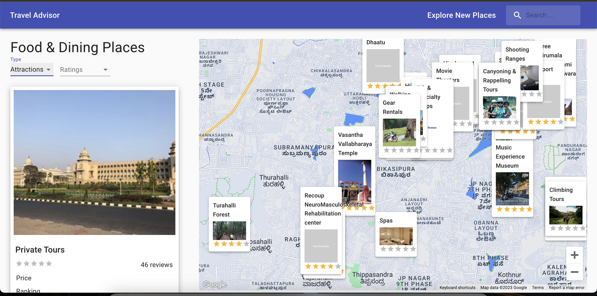

# Travel Advisor

App built using React and material ui.

### Screenshot

## Author

### Development

Want to contribute? Great!

To fix a bug or enhance an existing module, follow these steps:

- Fork the repo
- Make the appropriate changes in the files
- Commit your changes (`git commit -m 'Message goes here'`)
- Push to the branch (`git push`)
- Create a Pull Request

### Bug / Feature Request

If you find a bug or to request a new feature, kindly open an issue [here](https://github.com/KavyaMVG/travel-advisor/issues/new).
